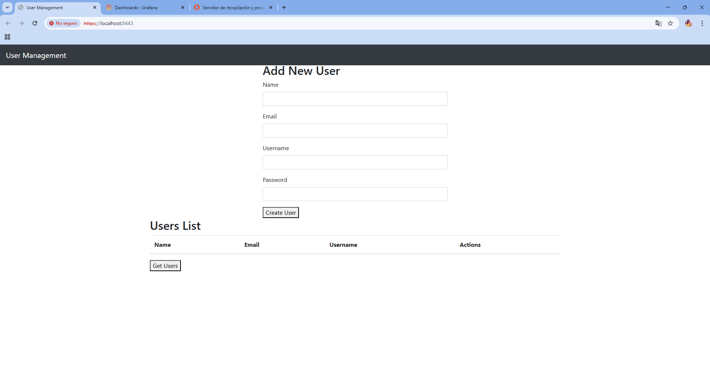
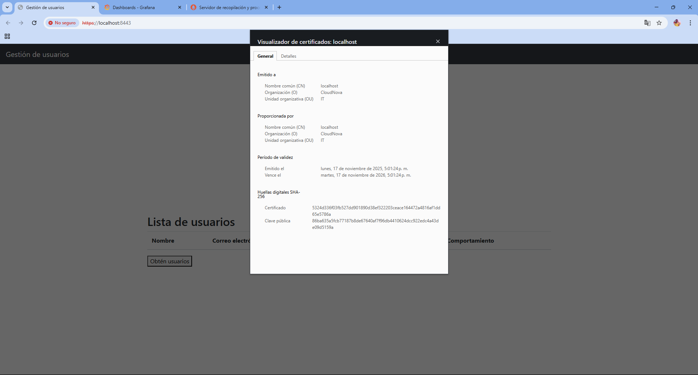
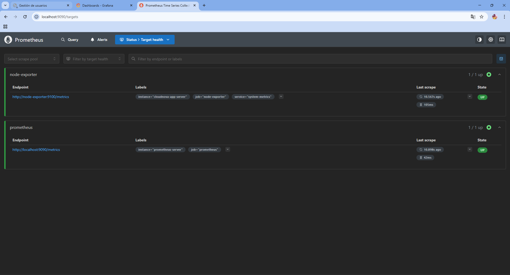
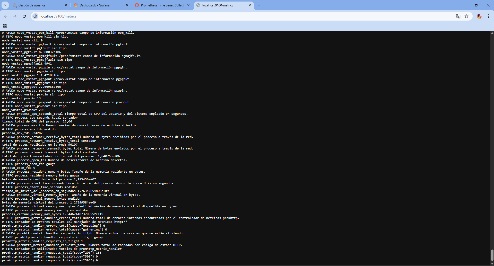
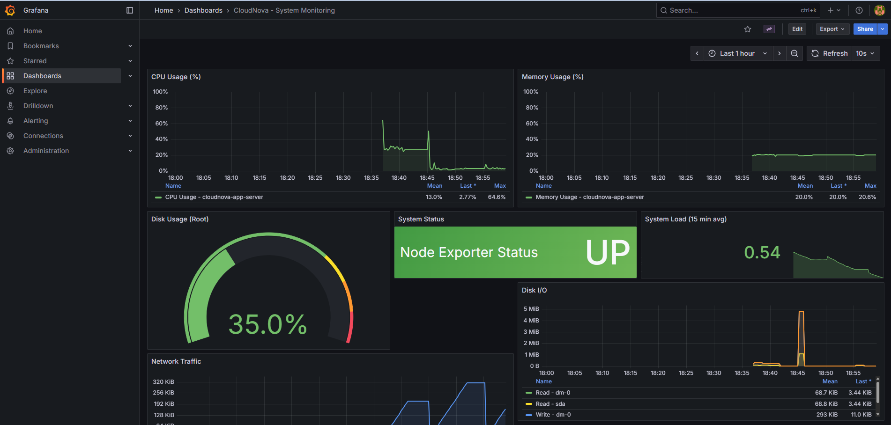
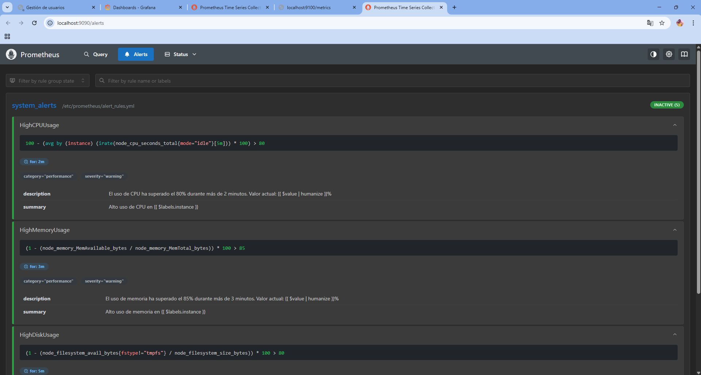
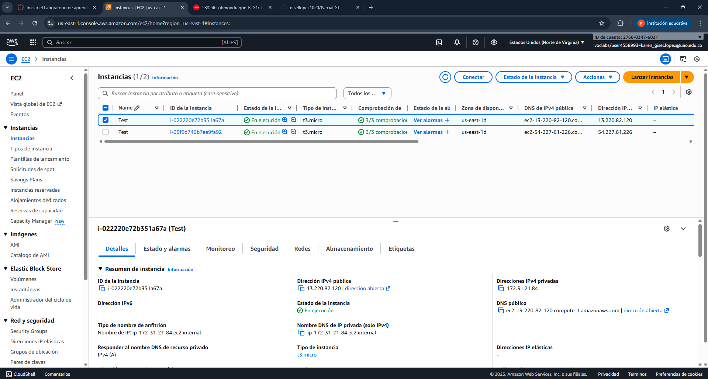
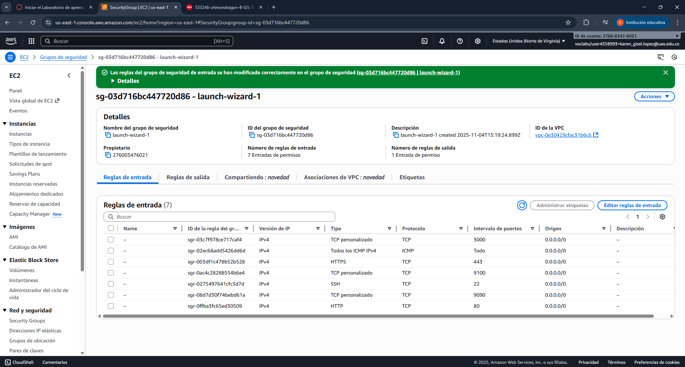

# CloudNova - Parcial Final Servicios Telemáticos

## 📋 Descripción del Proyecto

Este proyecto implementa una solución completa de despliegue seguro, monitoreo y visualización de una aplicación web en contenedores Docker, con monitoreo mediante Prometheus y Node Exporter, y visualización de métricas con Grafana.

**Universidad Autónoma de Occidente**  
**Asignatura:** Servicios Telemáticos

> **⚠️ IMPORTANTE:** Este proyecto incluye el repositorio **MiniWebApp** proporcionado por el profesor Óscar Mondragón en la carpeta `app/`.

---

## 🏗️ Arquitectura del Sistema

```
┌─────────────────────────────────────────────────────────┐
│                    CloudNova Stack                       │
├─────────────────────────────────────────────────────────┤
│                                                          │
│  ┌──────────────┐    ┌──────────────┐                  │
│  │   Nginx      │    │    Node      │                  │
│  │   (HTTPS)    │    │   Exporter   │                  │
│  │  Port 443/80 │    │  Port 9100   │                  │
│  └──────────────┘    └──────────────┘                  │
│         │                     │                          │
│         │                     ├──────────┐              │
│         │                     │          │              │
│  ┌──────────────┐    ┌──────────────┐  │              │
│  │  Prometheus  │◄───┤   Grafana    │  │              │
│  │  Port 9090   │    │  Port 3000   │  │              │
│  └──────────────┘    └──────────────┘  │              │
│                                          │              │
│         cloudnova-network (Docker Bridge)              │
└─────────────────────────────────────────────────────────┘
```

---

## Componentes Implementados

### 1. Aplicación Web con Docker (1.5 puntos)
- ✅ Servidor web Nginx configurado
- ✅ Certificado SSL autofirmado
- ✅ Redirección automática HTTP → HTTPS
- ✅ Dockerfile optimizado
- ✅ Docker Compose para orquestación

### 2. Despliegue en AWS EC2 (1.0 punto)
- ✅ Instancia EC2 configurada
- ✅ Reglas de seguridad HTTP/HTTPS
- ✅ Docker instalado
- ✅ Acceso remoto verificado

### 3. Monitoreo con Prometheus (1.5 puntos)
- ✅ Prometheus configurado y corriendo
- ✅ Node Exporter instalado
- ✅ 3 métricas documentadas
- ✅ Alertas configuradas (CPU > 80%)

### 4. Visualización con Grafana (1.0 punto)
- ✅ Grafana conectado a Prometheus
- ✅ Dashboard personalizado
- ✅ Paneles de CPU/memoria y disco
- ✅ Panel preconfigurado importado

---

## Instalación y Despliegue

### Paso 1: Clonar los Repositorios Necesarios
```bash
# Clonar este repositorio del parcial
git clone https://github.com/gisellopez1020/Parcial-ST.git

# Levantar la máquina virtual con
vagrant up
vagrant ssh

# Entrar al directorio compartido
cd parcial-telematicos

# El repositorio MiniWebApp ya se encuentra clonado en la carpeta app de este repositorio

```

### Paso 2: Generar Certificados SSL
```bash
chmod +x generate-ssl.sh
./generate-ssl.sh
```

Este script generará:
- `nginx/ssl/nginx.crt` - Certificado SSL
- `nginx/ssl/nginx.key` - Clave privada

### Paso 3: Construir y Levantar los Servicios
```bash
# Construir las imágenes
docker-compose build

# Levantar todos los servicios
docker-compose up -d

# Verificar que todos los contenedores estén corriendo
docker-compose ps
```

### Paso 4: Verificar el Funcionamiento

#### Aplicación Web
- **HTTP:** http://localhost (redirige automáticamente a HTTPS)
- **HTTPS:** https://localhost
- ⚠️ **Nota:** El navegador mostrará una advertencia de seguridad debido al certificado autofirmado. Solución: Opciones avanzadas --> continuar al sitio.

#### Prometheus
- **URL:** http://localhost:9090
- **Verificar targets:** http://localhost:9090/targets
- **Verificar alertas:** http://localhost:9090/alerts

#### Node Exporter
- **URL:** http://localhost:9100/metrics
- Aquí puedes ver todas las métricas del sistema en formato Prometheus

#### Grafana
- **URL:** http://localhost:3000
- **Usuario:** admin
- **Contraseña:** admin123
- El datasource de Prometheus ya está configurado automáticamente
- El dashboard "CloudNova - System Monitoring" está pre-cargado

---

## 📊 Métricas Monitoreadas

### 1. **CPU Usage (Uso de CPU)**
```promql
100 - (avg by(instance) (irate(node_cpu_seconds_total{mode="idle"}[5m])) * 100)
```
**Utilidad:** Permite identificar baches en procesamiento. Si el uso de CPU se mantiene constantemente alto (>80%), indica que el sistema necesita más recursos o que hay procesos consumiendo excesivamente CPU. Es crítico para:
- Detectar procesos runaway
- Planificar escalamiento horizontal/vertical
- Identificar problemas de rendimiento en aplicaciones

### 2. **Memory Usage (Uso de Memoria)**
```promql
(1 - (node_memory_MemAvailable_bytes / node_memory_MemTotal_bytes)) * 100
```
**Utilidad:** Monitorea el consumo de memoria RAM del sistema. Cuando la memoria disponible es baja (<15%), el sistema puede empezar a usar swap, degradando significativamente el rendimiento. Es esencial para:
- Prevenir OOM (Out of Memory) kills
- Detectar memory leaks en aplicaciones
- Dimensionar correctamente los recursos
- Evitar degradación de performance

### 3. **Disk Usage (Uso de Disco)**
```promql
(1 - (node_filesystem_avail_bytes{mountpoint="/",fstype!="tmpfs"} / node_filesystem_size_bytes{mountpoint="/"})) * 100
```
**Utilidad:** Controla el espacio disponible en disco. Cuando el disco se llena (>90%), pueden ocurrir fallos en aplicaciones, pérdida de logs, y en casos extremos, el sistema puede dejar de funcionar. Es importante para:
- Prevenir fallos de aplicaciones por falta de espacio
- Planificar limpieza de logs y datos antiguos
- Alertar antes de alcanzar límites críticos
- Dimensionar storage adecuadamente

### Métricas Adicionales Monitoreadas

#### 4. **Network Traffic**
```promql
node_network_receive_bytes_total
node_network_transmit_bytes_total
```
**Utilidad:** Monitorea el tráfico de red entrante y saliente.

#### 5. **Disk I/O**
```promql
rate(node_disk_read_bytes_total[5m])
rate(node_disk_written_bytes_total[5m])
```
**Utilidad:** Mide las operaciones de lectura/escritura en disco.

#### 6. **System Load Average**
```promql
node_load15
```
**Utilidad:** Indica la carga promedio del sistema en los últimos 15 minutos.

---

## 🚨 Alertas Configuradas

### 1. HighCPUUsage
- **Condición:** CPU > 80% por más de 2 minutos
- **Severidad:** Warning
- **Acción:** Investigar procesos que consumen CPU

### 2. HighMemoryUsage
- **Condición:** Memoria > 85% por más de 3 minutos
- **Severidad:** Warning
- **Acción:** Revisar consumo de memoria, considerar escalamiento

### 3. HighDiskUsage
- **Condición:** Disco > 80% por más de 5 minutos
- **Severidad:** Warning
- **Acción:** Limpiar archivos innecesarios, rotar logs

### 4. InstanceDown
- **Condición:** Servicio no responde por más de 1 minuto
- **Severidad:** Critical
- **Acción:** Verificar estado del servicio, reiniciar si es necesario

### 5. HighSystemLoad
- **Condición:** Load average > 2x número de CPUs por 5 minutos
- **Severidad:** Warning
- **Acción:** Identificar procesos que generan carga

---

## 🌐 Despliegue en AWS EC2

### Pasos para Desplegar en AWS

#### 1. Crear Instancia EC2
```bash
# Tipo: t2.medium o superior
# OS: Ubuntu Server 22.04 LTS
# Storage: Mínimo 20GB
```

#### 2. Configurar Security Group
Abrir los siguientes puertos:
- **22** (SSH) - Tu IP
- **80** (HTTP) - 0.0.0.0/0
- **443** (HTTPS) - 0.0.0.0/0
- **3000** (Grafana) - 0.0.0.0/0
- **9090** (Prometheus) - 0.0.0.0/0

#### 3. Conectarse a la Instancia
```bash
ssh -i "tu-key.pem" ubuntu@<IP_PUBLICA_EC2>
```

#### 4. Instalar Docker y Docker Compose
```bash
# Actualizar sistema
sudo apt update && sudo apt upgrade -y

# Instalar Docker
curl -fsSL https://get.docker.com -o get-docker.sh
sudo sh get-docker.sh

# Agregar usuario al grupo docker
sudo usermod -aG docker $USER

# Instalar Docker Compose
sudo curl -L "https://github.com/docker/compose/releases/download/v2.20.0/docker-compose-$(uname -s)-$(uname -m)" -o /usr/local/bin/docker-compose
sudo chmod +x /usr/local/bin/docker-compose

# Verificar instalación
docker --version
docker-compose --version
```

#### 5. Clonar y Desplegar
```bash
# Clonar repositorio
git clone https://github.com/gisellopez1020/Parcial-ST.git
cd Parcial-ST

# Generar certificados
chmod +x generate-ssl.sh
./generate-ssl.sh

# Levantar servicios
docker-compose up -d

# Verificar
docker-compose ps
```

#### 6. Acceder a los Servicios
- **Aplicación:** https://<IP_PUBLICA_EC2>
- **Grafana:** http://<IP_PUBLICA_EC2>:3000
- **Prometheus:** http://<IP_PUBLICA_EC2>:9090

---

## 📁 Estructura del Proyecto

```
parcial-telematicos/
├── app/
│   └── (contenido de MiniWebApp)  # Repositorio clonado de clase
├── nginx/
│   ├── nginx.conf              # Configuración Nginx con SSL
│   └── ssl/
│       ├── nginx.crt           # Certificado SSL (generado)
│       └── nginx.key           # Clave privada (generada)
├── prometheus/
│   ├── prometheus.yml          # Configuración Prometheus
│   └── alert_rules.yml         # Reglas de alertas
├── grafana/
│   ├── datasources/
│   │   └── prometheus.yml      # Datasource de Prometheus
│   └── dashboards/
│       ├── dashboard-provider.yml
│       └── system-monitoring.json  # Dashboard personalizado
├── supervisor/
|   ├── supervisord.conf        # Archivos para supervisar los servicios dentro del contenedor
├── Dockerfile.flask            # Imagen Docker de la app Flask
├── docker-compose.yml          # Orquestación de servicios
├── generate-ssl.sh             # Script para generar SSL
└── README.md                   # Esta documentación
```

---

## 📸 Evidencias

1. **Aplicación Web funcionando con HTTPS**
   - URL: https://localhost
   - Página cargada con candado seguro
   
   

2. **Prometheus mostrando targets**
   - URL: http://localhost:9090/targets
   - Todos los targets en estado "UP"
   

3. **Node Exporter expniendo métricas**
   - URL: http://localhost:9100/metrics
   - Métricas del sistema visibles
   

4. **Dashboard de Grafana**
   - Dashboard "CloudNova - System Monitoring"
   - Paneles mostrando datos en tiempo real
   

5. **Alertas configuradas en Prometheus**
   - URL: http://localhost:9090/alerts
   - Reglas de alertas visibles
   

6. **Despliegue en AWS EC2**
   - Instancia EC2 corriendo
   

   - Grupo de seguridad con reglas correctas
   

   - Aplicación accesible desde IP pública

---

## 💡 Conclusiones Técnicas

### ¿Qué aprendimos al integrar Docker, AWS y Prometheus?

La integración de estas tecnologías me permitió comprender el ciclo completo DevOps moderno:

1. **Docker y Contenedores:**
   - La containerización facilita el despliegue consistente entre entornos (desarrollo, staging, producción)
   - Docker Compose simplifica la orquestación de múltiples servicios interdependientes
   - El aislamiento de servicios mejora la seguridad y mantenibilidad

2. **AWS EC2:**
   - La nube permite escalabilidad on-demand sin inversión en hardware
   - Los security groups son fundamentales para la seguridad perimetral
   - La elasticidad de recursos facilita adaptarse a cargas variables

3. **Prometheus y Observabilidad:**
   - El monitoreo proactivo es esencial para mantener SLAs
   - Las métricas time-series permiten análisis histórico y tendencias
   - Las alertas automatizadas reducen el tiempo de respuesta ante incidentes

4. **Integración Completa:**
   - La arquitectura basada en microservicios es más resiliente
   - La automatización reduce errores humanos y acelera despliegues
   - La observabilidad es tan importante como la funcionalidad

### ¿Qué fue lo más desafiante y cómo lo resolveriamos en un entorno real?

**Desafíos Encontrados:**

1. **Gestión de Certificados SSL:**
   - **Desafío:** Configurar HTTPS con certificados autofirmados genera warnings
   - **Solución Real:** Usar Let's Encrypt con Certbot para certificados válidos y renovación automática. Implementar un proxy reverso con Traefik que maneje SSL automáticamente.

2. **Seguridad en Contenedores:**
   - **Desafío:** Los contenedores ejecutándose como root presentan riesgos
   - **Solución Real:** Implementar usuarios no privilegiados, usar Docker secrets para credenciales, escanear imágenes con Trivy o Clair, aplicar políticas de seguridad con OPA.

3. **Persistencia de Datos:**
   - **Desafío:** Pérdida de métricas al reiniciar contenedores
   - **Solución Real:** Usar volúmenes Docker persistentes, implementar backups automáticos a S3, considerar bases de datos time-series como InfluxDB o TimescaleDB para retención a largo plazo.

4. **Escalabilidad:**
   - **Desafío:** La arquitectura actual no escala horizontalmente
   - **Solución Real:** Implementar Kubernetes con Helm charts, usar auto-scaling basado en métricas, implementar load balancers (ALB/NLB en AWS), usar servicios administrados (ECS, EKS).

5. **Alta Disponibilidad:**
   - **Desafío:** Single point of failure en cada componente
   - **Solución Real:** Desplegar en múltiples availability zones, implementar health checks y auto-recovery, usar RDS para bases de datos con replicas, implementar circuit breakers.

### ¿Qué beneficio aporta la observabilidad en el ciclo DevOps?

La observabilidad es un pilar fundamental de DevOps moderno y aporta múltiples beneficios:

1. **Detección Proactiva de Problemas:**
   - Las alertas permiten identificar problemas antes de que afecten usuarios
   - El monitoreo continuo reduce el MTTR (Mean Time To Recovery)
   - Las métricas históricas ayudan a predecir fallos futuros

2. **Toma de Decisiones Basada en Datos:**
   - Las métricas guían decisiones de escalamiento y optimización
   - El análisis de tendencias permite capacity planning efectivo
   - Los datos de performance justifican inversiones en infraestructura

3. **Debugging y Root Cause Analysis:**
   - Los dashboards facilitan correlacionar eventos y métricas
   - Los logs centralizados aceleran la investigación de incidentes
   - El tracing distribuido permite seguir requests en microservicios

4. **Mejora Continua:**
   - Las métricas de performance permiten validar optimizaciones
   - El feedback loop rápido acelera el ciclo de desarrollo
   - Los KPIs de sistema alinean objetivos de ingeniería con negocio

5. **SRE y Confiabilidad:**
   - Los SLOs/SLIs basados en métricas definen estándares de servicio
   - Error budgets permiten balancear velocidad vs estabilidad
   - La observabilidad es prerequisito para chaos engineering

6. **Colaboración Entre Equipos:**
   - Dashboards compartidos crean lenguaje común entre Dev y Ops
   - Las métricas de negocio conectan ingeniería con stakeholders
   - La transparencia mejora la comunicación y accountability

---

## 📚 Referencias y Recursos

### Documentación Oficial
- [Docker Documentation](https://docs.docker.com/)
- [Docker Compose Documentation](https://docs.docker.com/compose/)
- [Nginx Documentation](https://nginx.org/en/docs/)
- [Prometheus Documentation](https://prometheus.io/docs/)
- [Grafana Documentation](https://grafana.com/docs/)
- [Node Exporter](https://github.com/prometheus/node_exporter)

### Tutoriales Útiles
- [Prometheus con Node Exporter](https://prometheus.io/docs/guides/node-exporter/)
- [Integración Grafana-Prometheus](https://grafana.com/docs/grafana/latest/datasources/prometheus/)
- [Docker Security Best Practices](https://docs.docker.com/develop/security-best-practices/)
- [AWS EC2 Getting Started](https://docs.aws.amazon.com/ec2/index.html)

### Comunidad y Soporte
- [Prometheus Mailing List](https://prometheus.io/community/)
- [Grafana Community](https://community.grafana.com/)
- [Docker Community](https://forums.docker.com/)
- [Stack Overflow - DevOps](https://stackoverflow.com/questions/tagged/devops)

---

## 👤 Autores

**Nombres:** Karen Gisel López Ordoñez y Mónica Chicangana Palechor
**Universidad:** Universidad Autónoma de Occidente  
**Asignatura:** Servicios Telemáticos
